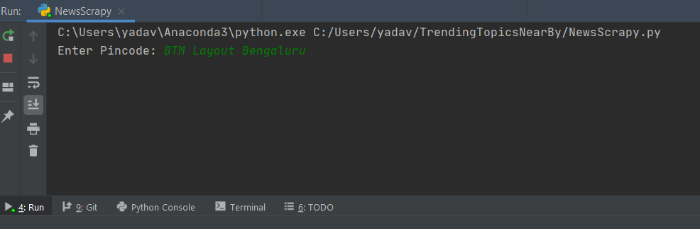
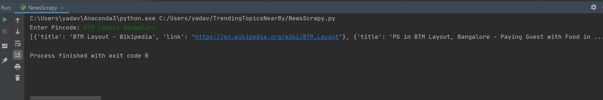

# TrendingTopicsNearBy:

Finding search trends based on Pincode or Area name. 

If I input Pincode or area name



then I will get top trending topics.



### How to run .py File:

#### Step 1
**Install BeautifulSoup**
```
pip install beautifulsoup4
```

#### Step 2
**Run NewsScrapy.py on one terminal**
```
python NewsScrapy.py
```